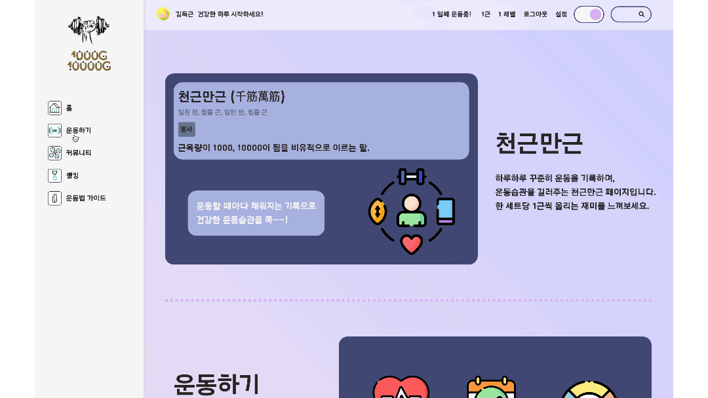

# 천근만근


## ✅ 프로젝트 진행 기간 및 인원

### 2023.11.13 ~ 2023.11.23 (11일), 2명

## **✅ 프로젝트 소개**

**🚩 서비스 한줄 소개**

```bash
하루하루 꾸준히 운동을 기록하고, 성장하는 모습을 시각화하여 보여줌으로써
꾸준히 운동할 수 있도록 동기부여를 도와주는 웹 서비스.
```

**🚩 기획 배경**

알고리즘을 풀며 성장하는 모습을 시각화해줘서 지속적으로 알고리즘 학습을 해 나갈 수 있도록 도와주는 solved.ac에서 아이디어를 착안.


**🚩 프로젝트 주요 기능**

1. 운동 카운터 & 운동 기록
> - TTS 음성 카운팅을 들으며 운동하고, 운동을 기록할 수 있습니다.
> - 운동 방법은 유튜브 영상을 참고할 수 있습니다.

2. 커뮤니티 게시판
> - 게시글 정렬, 인기 게시글 TOP3
> - 카카오 api를 이용해 장소 공유
> - 무한 대댓글 기능
> - 게시글 좋아요 기능

3. 운동 기록 분석
> - 다양한 그래프를 이용해 운동 기록 시각화.

4. 운동 정보 검색
> - Chat GPT가 알려주는 운동 정보. 유튜브 추천 영상.

5. 랭킹

6. 팔로우

7. 알림

8. 회원 검색

## ✅ 기술스택

**Environment**  

  

**BackEnd**  

  

**FrontEnd**  

 

  

**DataBase**    


**Tools**     


## ✅ 기능 소개
<table>
  <tr>
    <th style="text-align: center;">메인페이지</th>
    <th style="text-align: center;">운동법 가이드</th>
  </tr>
  <tr>
    <td></td>
    <td></td>
  </tr>
  <tr>
    <td>- 천근만근 서비스의 기능에 대해 설명하는 페이지입니다. <br>- 일부 서비스는 로그인을 해야 이용할 수 있습니다.</td>
    <td>- 알고 싶은 운동법을 검색하면 AI가 운동법을 설명해 줍니다. <br>- 따라할 수 있는 운동법 영상 3개가 출력됩니다. <br>- 로그인하지 않아도 이용할 수 있는 서비스입니다.</td>
  </tr>
</table>

<table>
  <tr>
    <th style="text-align: center;">회원 가입 및 로그인</th>
    <th style="text-align: center;">운동 카운터</th>
  </tr>
  <tr>
    <td></td>
    <td></td>
  </tr>
  <tr>
    <td>- 회원 가입을 하면 자동으로 로그인됩니다. <br>- 로그인을 하면 마이페이지로 이동합니다.</td>
    <td>- TTS가 카운트해주는 숫자를 들으며 운동할 수 있습니다. <br>- 운동 종류를 선택하고 원하는 세트 수를 설정하면 TTS가 숫자를 카운트해 줍니다.  <br>- 운동을 완료하면 마이페이지에서 운동 기록을 확인할 수 있습니다.</td>
  </tr>
</table>

<table>
  <tr>
    <th style="text-align: center;">커뮤니티 게시판</th>
    <th style="text-align: center;">무한대댓글</th>
  </tr>
  <tr>
    <td></td>
    <td></td>
  </tr>
  <tr>
    <td>- 게시글을 정렬할 수 있습니다. <br>- 인기 게시글 TOP3이 표시됩니다. <br>- 게시글을 작성할 때 지도에서 장소를 선택해서 공유할 수 있습니다. <br>- 마음에 드는 게시글을 '좋아요'할 수 있습니다. </td>
    <td>- 댓글을 작성/수정/삭제할 수 있습니다. <br>- 대댓글을 무한히 생성 가능합니다. <br>- 자식 댓글이 있는 경우에는 '삭제된 댓글'이라는 문구가 표시됩니다. <br>- 자식 댓글이 없는 경우에는 바로 삭제됩니다. </td>
  </tr>
</table>

<table>
  <tr>
    <th style="text-align: center;">운동 랭킹</th>
    <th style="text-align: center;">팔로우</th>
  </tr>
  <tr>
    <td></td>
    <td></td>
  </tr>
  <tr>
    <td>- 운동을 열심히 해오고 있는 회원의 랭킹을 볼 수 있습니다. <br>- 전체 랭킹과 운동 부위별 랭킹을 볼 수 있습니다. <br>- 회원을 클릭하면 해당 회원의 페이지로 이동합니다.   </td>
    <td>- 아이디나 닉네임으로 검색하여 다른 회원의 페이지를 방문할 수 있습니다. <br>- 다른 회원를 팔로잉할 수 있습니다. <br>- 마이페이지에서 내가 팔로잉한 회원 목록을 확인할 수 있습니다. <br>- 마이페이지의 팔로잉 목록을 클릭해서 다른 회원의 페이지를 방문할 수 있습니다. </td>
  </tr>
</table>

<table>
  <tr>
    <th style="text-align: center;">알림</th>
    <th style="text-align: center;">회원정보 수정 및 탈퇴</th>
  </tr>
  <tr>
    <td></td>
    <td></td>
  </tr>
  <tr>
    <td>- 내가 쓴 게시글에 다른 회원이 좋아요를 하면 알림을 받을 수 있습니다. <br>- 다른 회원이 나를 팔로잉하면 알림을 받을 수 있습니다. <br>- 게시글 좋아요 알림을 클릭하면 해당 게시글로 이동합니다. <br>-팔로우 알림을 클릭하면 해당 회원의 마이페이지로 이동합니다.</td>
    <td>- 회원 정보를 수정할 수 있습니다. <br>- 회원 탈퇴를 하면 자동으로 로그아웃되어 메인페이지로 이동합니다. </td>
  </tr>
</table>

<table>
  <tr>
    <th style="text-align: center;">다크모드</th>
    <th style="text-align: center;">&nbsp</th>
  </tr>
  <tr>
    <td></td>
    <td></td>
  </tr>
  <tr>
    <td>- 어두운 테마를 적용할 수 있습니다.</td>
    <td>&nbsp</td>
  </tr>
</table>


## ✅ 멤버소개

### 서만기<br>
담당 역할: 프론트엔드<br>
구현 사항:
1. 유튜브 API와 ChatGPT API를 활용한 운동 정보 설명
2. 운동 이름 선택 시 해당 운동의 횟수, 세트를 설정하고 음성으로 읽어주는 기능
3. 카카오맵 API를 활용하여 커뮤니티에서 사용자 간 위치 정보 공유
4. chart.js 라이브러리를 활용하여 운동 부위별 횟수를 시각화
5. moment.js 라이브러리를 사용하여 날짜별 운동 횟수 시각화
6. 사용자들의 운동 횟수를 카운트하여 랭킹을 보여주는 기능
7. 토글을 이용한 다크 모드 적용

### 김소연<br>
담당 역할: 백엔드<br>
구현 사항:
1. Spring Boot, MyBatis, MySQL을 이용해서 REST API 구현
2. 재귀적으로 작성한 컴포넌트를 활용한 커뮤니티의 대댓글 기능 - 프론트 일부 참여
